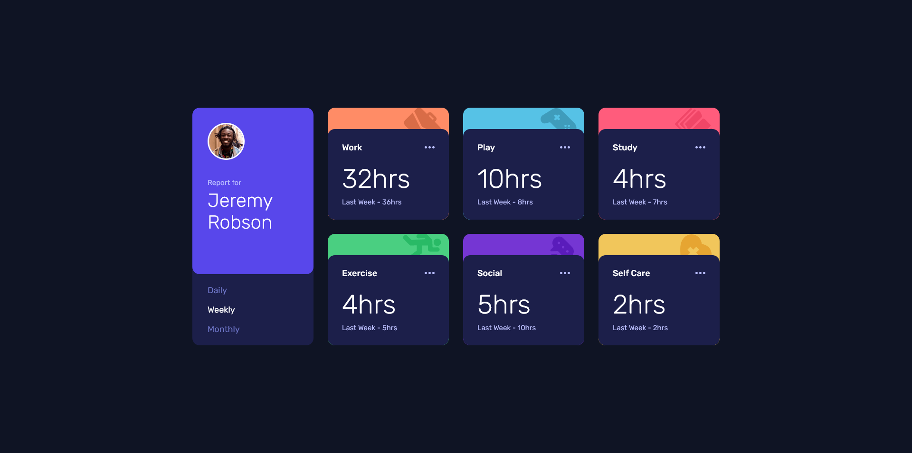
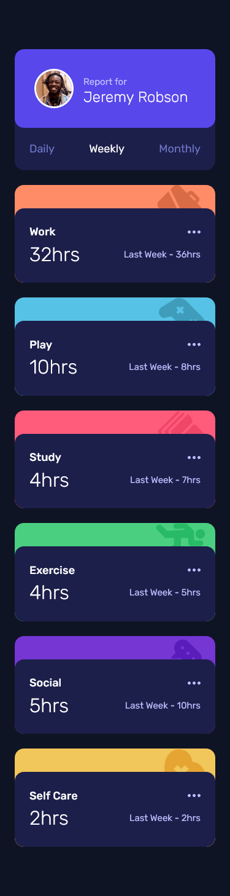

# Frontend Mentor - Time tracking dashboard solution

This is a solution to the [Time tracking dashboard challenge on Frontend Mentor](https://www.frontendmentor.io/challenges/time-tracking-dashboard-UIQ7167Jw). Frontend Mentor challenges help you improve your coding skills by building realistic projects.

## The challenge

Users should be able to:

- View the optimal layout for the site depending on their device's screen size
- See hover states for all interactive elements on the page
- Switch between viewing Daily, Weekly, and Monthly stats

## Links

- Solution URL: [Frontend Mentor Solution Page](https://www.frontendmentor.io/solutions/time-tracking-dashboard-5cvDB7O-Ff)
- Live Site URL: [GitHub Pages Site](https://karolbanat.github.io/time-tracking-dashboard/)

## Author

- Frontend Mentor - [@karolbanat](https://www.frontendmentor.io/profile/karolbanat)

## Screenshot

